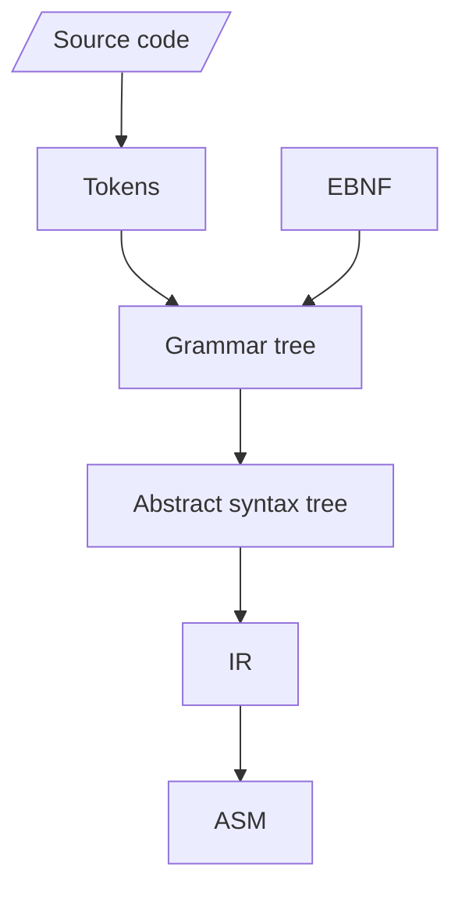

# Intro
My final project for my sixth year of [PTI](https://www.pti.be/)\
Its a simple compiler written in rust using EBNF syntax for the grammar rules of the language.

## General workings

```mermaid
flowchart TD
A[/Source code/]
B[Tokens]
C[Grammar tree]
D[Abstract syntax tree]
E[IR]
F[ASM]

G[EBNF]

A --> B
B --> C
G --> C
C --> D
D --> E
E --> F
```
