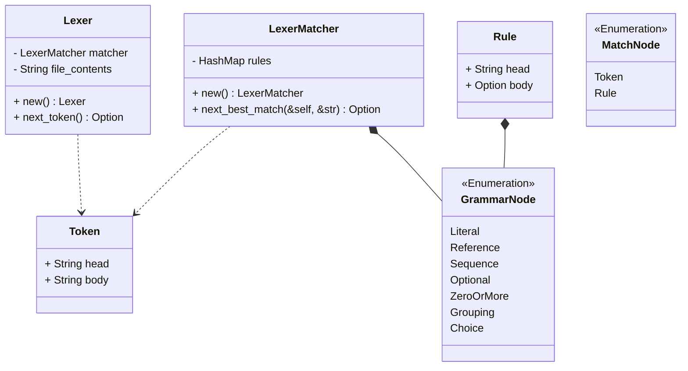

# Diagram of whole compiler

```mermaid
classDiagram
    class Lexer {
        - LexerMatcher matcher
        - String file_contents

        + new() Lexer
        + next_token() Option<Token>
    }
    class Token {
        + String head
        + String body
    }
    class LexerMatcher {
        - HashMap<String, GrammarNode> rules

        + new() LexerMatcher
        + next_best_match(&self, &str) Option<Token>
    }
    class GrammarNode {
        <<Enumeration>>
        Literal
        Reference
        Sequence
        Optional
        ZeroOrMore
        Grouping
        Choice
    }
    class Rule {
       + String head
       + Option<GrammarNode> body
    }
    class MatchNode {
        <<Enumeration>>
        Token
        Rule
    }

    Lexer ..> Token
    LexerMatcher ..> Token
    LexerMatcher *-- GrammarNode
    Rule *-- GrammarNode
```
