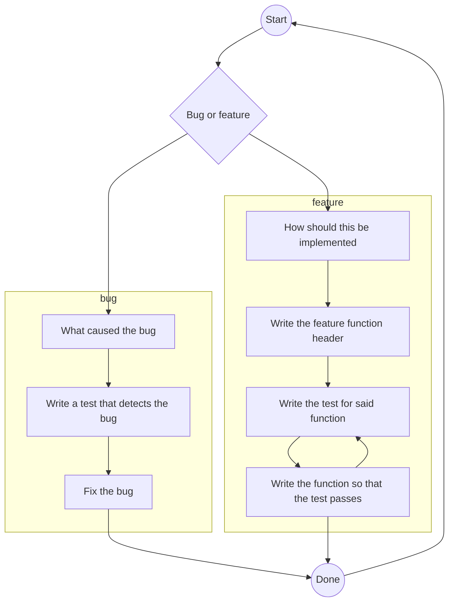

# My workflow
Based on TDD

```mermaid
flowchart TD
start((Start))
what{Bug or feature}

find[What caused the bug]
write_bug_test[Write a test that detects the bug]
fix[Fix the bug]

think[How should this be implemented]
write_header[Write the feature function header]
write_test[Write the test for said function]
write_function[Write the function so that the test passes]

end_node((Done))

start --> what

what --> find
subgraph bug
    find --> write_bug_test
    write_bug_test --> fix
end
fix --> end_node

what --> think
subgraph feature
    think --> write_header
    write_header --> write_test
    write_test --> write_function
    write_function --> write_test
end
write_function --> end_node

end_node --> start
```
