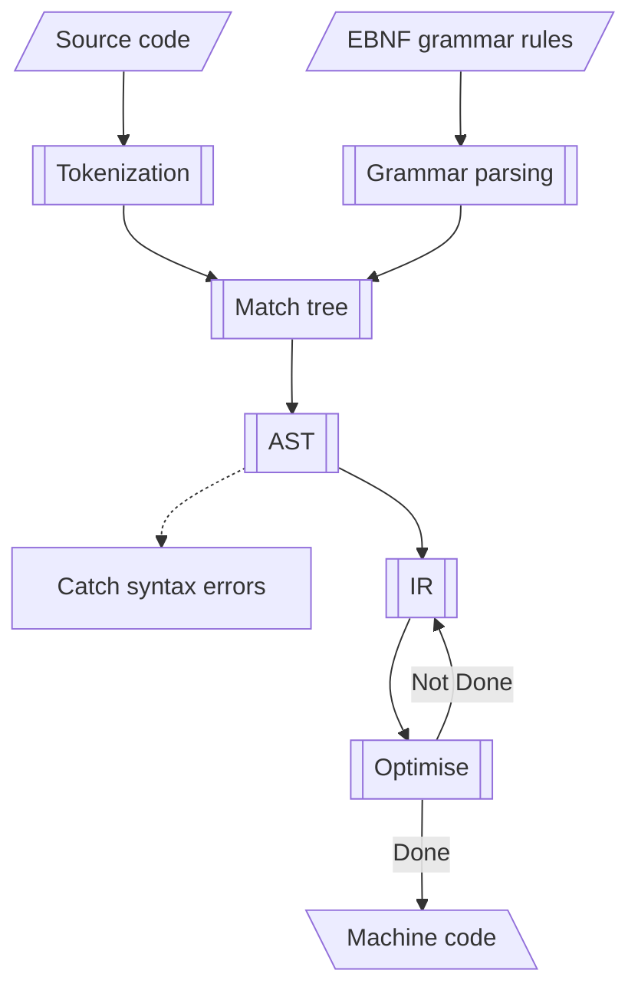
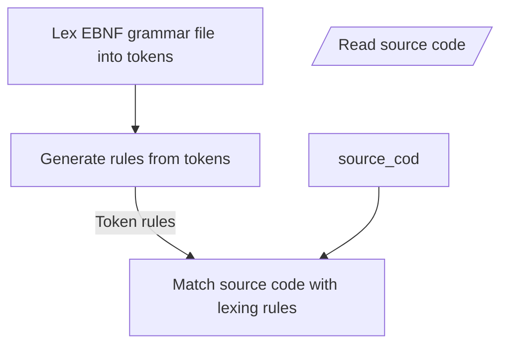

# Compiler workings
## General overview

```mermaid
flowchart TD
A[/Source code/]
B[[Tokenization]]
H[[Match tree]]
C[[AST]]
G[Catch syntax errors]
D[[IR]]
E[[Optimise]]
F[\Machine code\]

AB[/EBNF grammar rules/]
BB[[Grammar parsing]]

A --> B
B --> H
H --> C
C --> D
C -.-> G
D --> E
E --Not Done--> D
E --Done--> F

AB --> BB
BB --> H
```

## Precise workings

```mermaid 
flowchart TD

lexing[Lex EBNF grammar file into tokens]
rule_gen[Generate rules from tokens]

source_code[/Read source code/]
rule_matching[Match source code with lexing rules]

lexing --> rule_gen
rule_gen --> |Token rules| rule_matching
source_cod --> rule_matching
``` 
