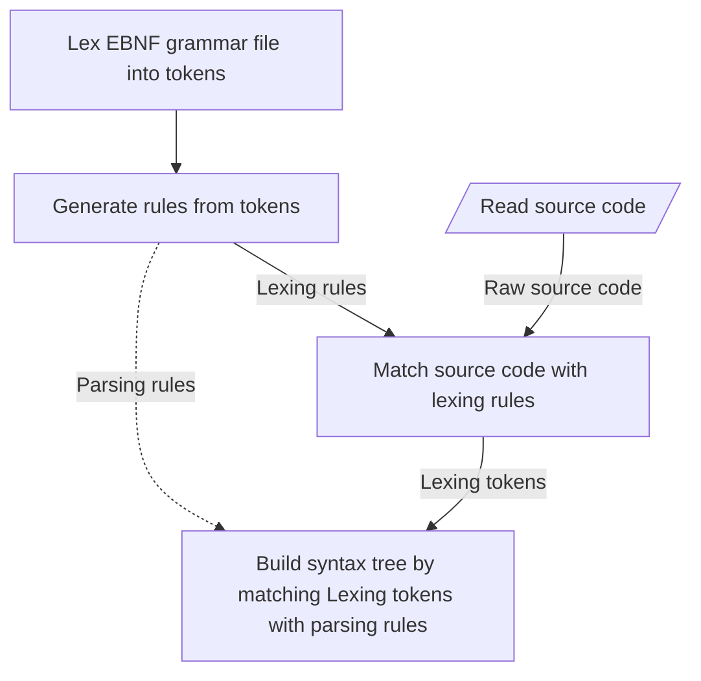
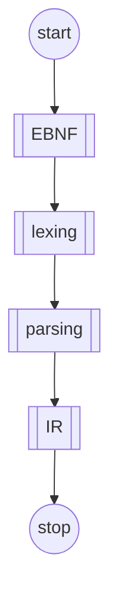

# Compiler workings

```mermaid 
flowchart TD

grammar_lexing[Lex EBNF grammar file into tokens]
rule_gen[Generate rules from tokens]

source_code[/Read source code/]
source_lexing[Match source code with lexing rules]

build_tree[Build syntax tree by matching Lexing tokens with parsing rules]

grammar_lexing --> rule_gen
rule_gen --> |Lexing rules| source_lexing
source_code --> |Raw source code| source_lexing
source_lexing --> |Lexing tokens| build_tree
rule_gen -.-> |Parsing rules| build_tree
``` 

# Program flow

```mermaid
flowchart TD
start((start))
EBNF[[EBNF]]
lexing[[lexing]]
parsing[[parsing]]
IR[[IR]]
stop((stop))

start --> EBNF
EBNF --> lexing
lexing --> parsing
parsing --> IR
IR --> stop
```
